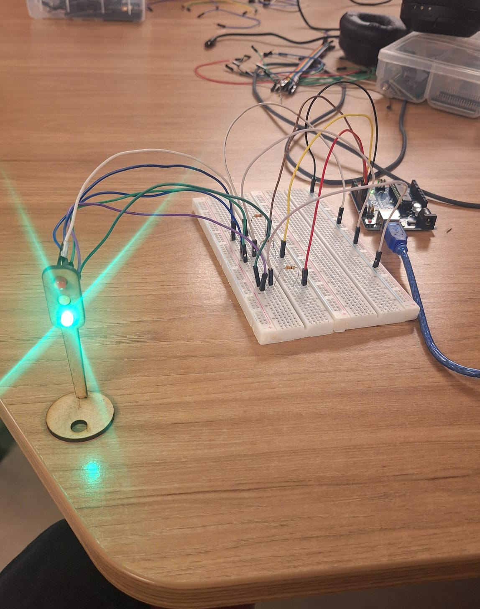

# Ponderada - Semáforo IoT

**Aluno**: Gabriel Willian Bartmanovicz
**Turma**: 15

## Descrição do Projeto

Este projeto utiliza um Arduino Uno para controlar um semáforo simulado com LEDs. O semáforo alterna entre as cores verde, amarelo e vermelho, representando o funcionamento típico de um semáforo de trânsito. O objetivo é demonstrar o controle básico de LEDs usando um microcontrolador.

## Link do Video de Funcionamento do Projeto

https://youtu.be/Yfqjo5lGvdU

O código está disponível no arquivo `main.ino`.

## Componentes Necessários

| Item                                       | Quantidade | Observações             |
| ------------------------------------------ | ---------: | ----------------------- |
| Arduino Uno                                |          1 | -                       |
| LED (5 mm, Cores vemelho, amarelo e verde) |         3x | Use um resistor por LED |
| Jumpers (7 macho-macho e 6 macho-femea)    |        13x | Cabos para conexões     |
| Resistores (330 ohms)                      |         3x |                         |
| Protoboard                                 |          1 | -                       |

## Tabela de Avaliação entre Pares

#### Avaliador: Antonio Cillo

| Critério                                                                                                            | Contempla (Pontos) | Contempla Parcialmente (Pontos) | Não Contempla (Pontos) | Observações do Avaliador |
| ------------------------------------------------------------------------------------------------------------------- | ------------------ | ------------------------------- | ---------------------- | ------------------------ |
| Montagem física com cores corretas, boa disposição dos fios e uso adequado de resistores                            | Até 3              | Até 1,5                         | 0                      | Nota: 3                  |
| Temporização adequada conforme tempos medidos com auxílio de algum instrumento externo                              | Até 3              | Até 1,5                         | 0                      | Nota: 3                  |
| Código implementa corretamente as fases do semáforo e estrutura do código (variáveis representativas e comentários) | Até 3              | Até 1,5                         | 0                      | Nota: 3                  |
| Ir além: Implementou um componente de extra, fez com millis() ao invés do delay() e/ou usou ponteiros no código     | Até 1              | Até 0,5                         | 0                      | Nota: 1                  |
|                                                                                                                     |                    |                                 |                        | Pontuação Total : 10     |

#### Avaliador: Carlos Quaglia

| Critério                                                                                                            | Contempla (Pontos) | Contempla Parcialmente (Pontos) | Não Contempla (Pontos) | Observações do Avaliador |
| ------------------------------------------------------------------------------------------------------------------- | ------------------ | ------------------------------- | ---------------------- | ------------------------ |
| Montagem física com cores corretas, boa disposição dos fios e uso adequado de resistores                            | Até 3              | Até 1,5                         | 0                      | Nota: 3                  |
| Temporização adequada conforme tempos medidos com auxílio de algum instrumento externo                              | Até 3              | Até 1,5                         | 0                      | Nota: 3                  |
| Código implementa corretamente as fases do semáforo e estrutura do código (variáveis representativas e comentários) | Até 3              | Até 1,5                         | 0                      | Nota: 3                  |
| Ir além: Implementou um componente de extra, fez com millis() ao invés do delay() e/ou usou ponteiros no código     | Até 1              | Até 0,5                         | 0                      | Nota: 1                  |
|                                                                                                                     |                    |                                 |                        | Pontuação Total : 10     |
